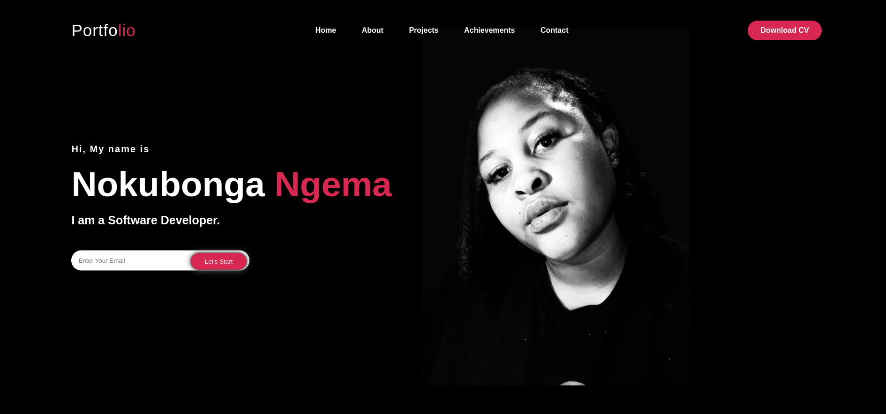
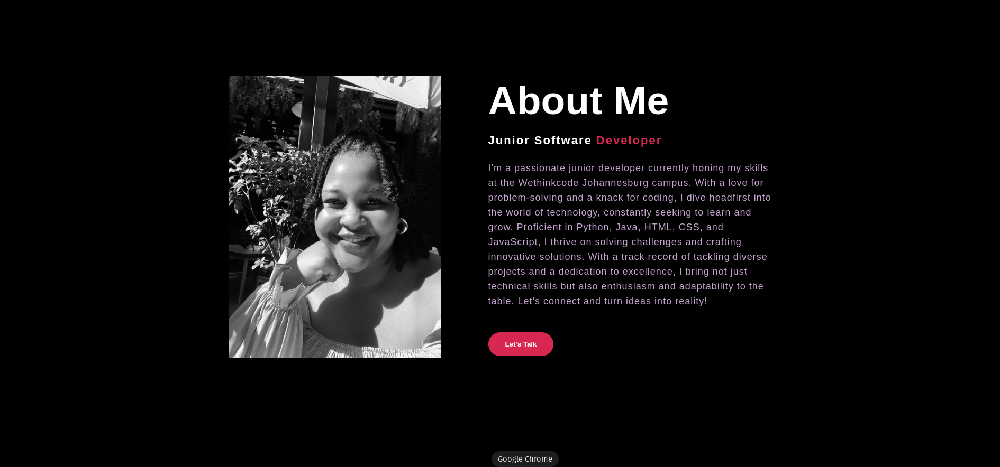
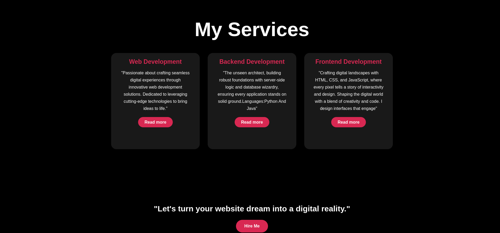

<h2 align="center">
  Personal Portfolio - MyPortfolio 
  <a href="https://.app/" target="_blank">Nokubonga CodeCrafterNoku</a>
</h2>

 

 

 &nbsp;
 &nbsp;
 &nbsp;

<h3 align="center">
    🔹
    <a href="https://github.com/CodeCrafterNoku/CODSOFT-PORTFOLIO/issues">Report Bug</a> &nbsp; &nbsp;
    🔹
    <a href="https://github.com/CodeCrafterNoku/CODSOFT-PORTFOLIO/issues">Request Feature</a>
</h3>

This project was built using these technologies.

- HTML
- CSS
- FIGMA

## Features

**📖 Multi-Page Layout**

**🎨 Built using html,css and designed using figma**

**📱 front end**

### Show your support

Give a ⭐ if you like this app!

# MORE ON THE WEBSITE

**Personal Portfolio Project README**

### Project Overview:

This project is a personal portfolio website created using HTML and CSS. It serves as a showcase of your skills, projects, and experiences.

### Project Structure:

The project consists of the following files and directories:

- **index.html**: This is the main HTML file of the website. It contains the structure and content of the portfolio page.
  
- **style.css**: This file contains the CSS styles used to define the layout, design, and appearance of the portfolio page.

- **images/**: This directory contains all the images used in the portfolio, such as project screenshots, profile picture, etc.

### Running the Project:

To run the project, simply open the `index.html` file in a web browser. You can do this by right-clicking on the file and selecting "Open with" and then choosing your preferred browser. Alternatively, you can drag the `index.html` file into your browser window.

### Customization:

Feel free to customize the portfolio according to your preferences and needs. You can modify the content in the `index.html` file to add your own information, projects, and experiences. Additionally, you can edit the `style.css` file to change the design and layout of the portfolio to better suit your taste.

### Credits:

This project was created using Visual Studio Code (VSCode), a powerful and popular code editor developed by Microsoft. 

### Contact:

If you have any questions, suggestions, or feedback regarding this project, feel free to reach out to me at nokubongangema8@gmail.com

